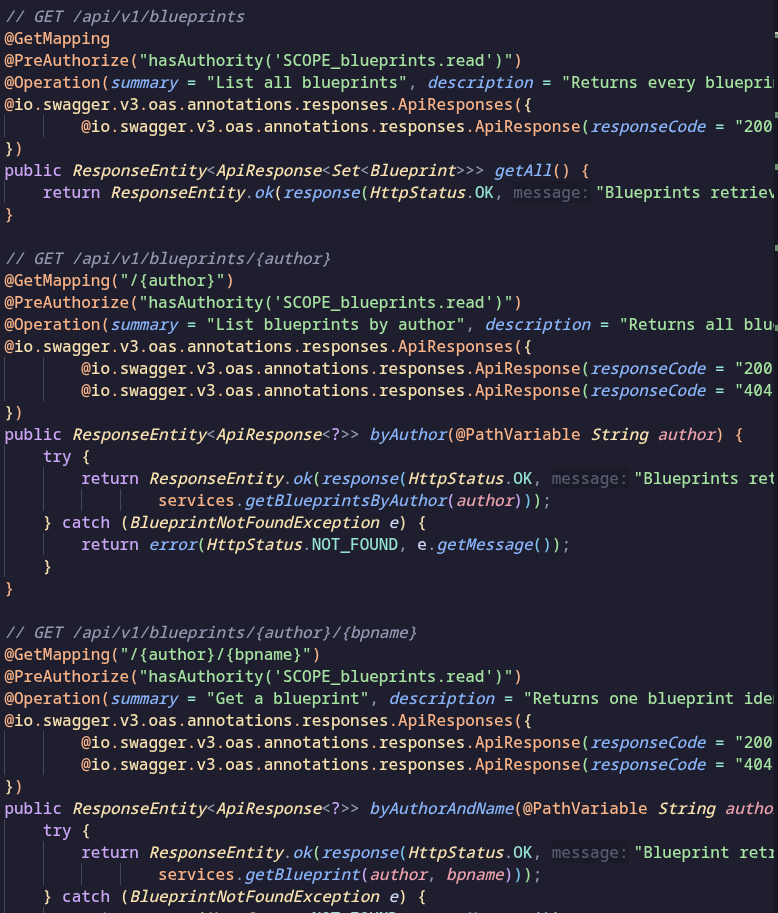
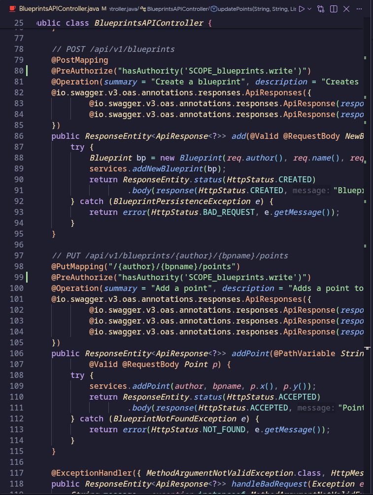
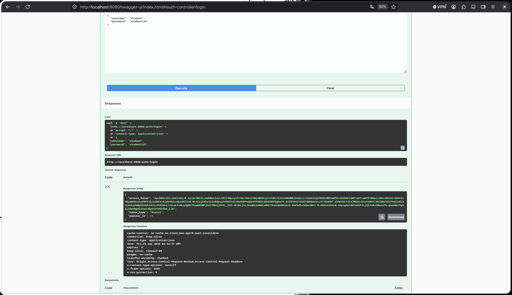
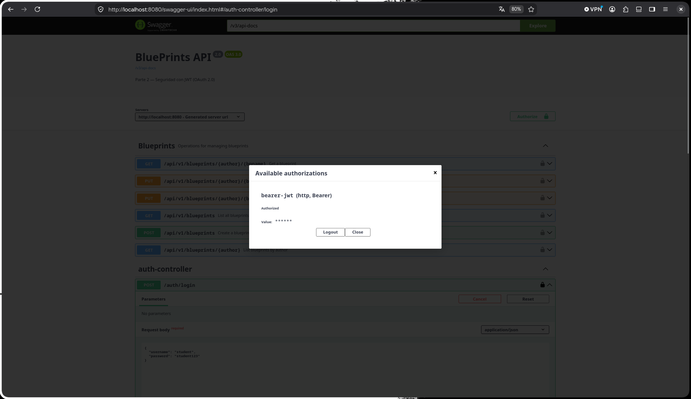

# Escuela Colombiana de Ingeniería Julio Garavito
## Arquitectura de Software – ARSW
### Laboratorio – Parte 2: BluePrints API con Seguridad JWT (OAuth 2.0)

Este laboratorio extiende la **Parte 1** ([Lab_P1_BluePrints_Java21_API](https://github.com/DECSIS-ECI/Lab_P1_BluePrints_Java21_API)) agregando **seguridad a la API** usando **Spring Boot 3, Java 21 y JWT (OAuth 2.0)**.  
El API se convierte en un **Resource Server** protegido por tokens Bearer firmados con **RS256**.  
Incluye un endpoint didáctico `/auth/login` que emite el token para facilitar las pruebas.

---

## Objetivos
- Implementar seguridad en servicios REST usando **OAuth2 Resource Server**.
- Configurar emisión y validación de **JWT**.
- Proteger endpoints con **roles y scopes** (`blueprints.read`, `blueprints.write`).
- Integrar la documentación de seguridad en **Swagger/OpenAPI**.

---

## Requisitos
- JDK 21
- Maven 3.9+
- Git

---

## Ejecución del proyecto
1. Clonar o descomprimir el proyecto:
   ```bash
   git clone https://github.com/DECSIS-ECI/Lab_P2_BluePrints_Java21_API_Security_JWT.git
   cd Lab_P2_BluePrints_Java21_API_Security_JWT
   ```
   ó si el profesor entrega el `.zip`, descomprimirlo y entrar en la carpeta.

2. Ejecutar con Maven:
   ```bash
   mvn -q -DskipTests spring-boot:run
   ```

3. Verificar que la aplicación levante en `http://localhost:8080`.

---

## Endpoints principales

### 1. Login (emite token)
```
POST http://localhost:8080/auth/login
Content-Type: application/json

{
  "username": "student",
  "password": "student123"
}
```
Respuesta:
```json
{
  "access_token": "eyJhbGciOiJSUzI1NiIsInR5cCI6IkpXVCJ9...",
  "token_type": "Bearer",
  "expires_in": 3600
}
```

### 2. Consultar blueprints (requiere scope `blueprints.read`)
```
GET http://localhost:8080/api/blueprints
Authorization: Bearer <ACCESS_TOKEN>
```

### 3. Crear blueprint (requiere scope `blueprints.write`)
```
POST http://localhost:8080/api/blueprints
Authorization: Bearer <ACCESS_TOKEN>
Content-Type: application/json

{
  "name": "Nuevo Plano"
}
```

---

## Swagger UI
- URL: [http://localhost:8080/swagger-ui/index.html](http://localhost:8080/swagger-ui/index.html)
- Pulsa **Authorize**, ingresa el token en el formato:
  ```
  Bearer eyJhbGciOi...
  ```

---

## Estructura del proyecto
```
src/main/java/co/edu/eci/blueprints/
  ├── api/BlueprintController.java       # Endpoints protegidos
  ├── auth/AuthController.java           # Login didáctico para emitir tokens
  ├── config/OpenApiConfig.java          # Configuración Swagger + JWT
  └── security/
       ├── SecurityConfig.java
       ├── MethodSecurityConfig.java
       ├── JwtKeyProvider.java
       ├── InMemoryUserService.java
       └── RsaKeyProperties.java
src/main/resources/
  └── application.yml
```

---

## Actividades propuestas
1. Revisar el código de configuración de seguridad (`SecurityConfig`) e identificar cómo se definen los endpoints públicos y protegidos.
2. Explorar el flujo de login y analizar las claims del JWT emitido.
3. Extender los scopes (`blueprints.read`, `blueprints.write`) para controlar otros endpoints de la API, del laboratorio P1 trabajado.
4. Modificar el tiempo de expiración del token y observar el efecto.
5. Documentar en Swagger los endpoints de autenticación y de negocio.

---

## Lecturas recomendadas
- [Spring Security Reference – OAuth2 Resource Server](https://docs.spring.io/spring-security/reference/servlet/oauth2/resource-server/index.html)
- [Spring Boot – Securing Web Applications](https://spring.io/guides/gs/securing-web/)
- [JSON Web Tokens – jwt.io](https://jwt.io/introduction)

---

## Licencia
Proyecto educativo con fines académicos – Escuela Colombiana de Ingeniería Julio Garavito.

---

## Solucion del laboratorio

1. En la clase "SecurityConfig.java" donde se definen cuale seran los endpoint publicos (todo endpoint al cual cualquier usuario podra acceder sin encesidad de algun permiso valido) se define con la ruta del endpoint seguido por un ".permitAll" que asegura que el endpoint no tiene resticcion de acceso; y los endpoints protegidos (todo endpoint que requerira de un token con un JWT valido que se asigne), se definen con la ruta del enpoint seguido por un .hasAnyAuthority("SCOPE_xxx").

    ```
    @Bean
        public SecurityFilterChain filterChain(HttpSecurity http) throws Exception {
            http
                .csrf(csrf -> csrf.disable())
                .authorizeHttpRequests(auth -> auth
                    .requestMatchers("/actuator/health", "/auth/login").permitAll()
                    .requestMatchers("/v3/api-docs/**", "/swagger-ui/**", "/swagger-ui.html").permitAll()
                    .requestMatchers("/api/**").hasAnyAuthority("SCOPE_blueprints.read", "SCOPE_blueprints.write")
                    .anyRequest().authenticated()
                )
                .oauth2ResourceServer(oauth2 -> oauth2.jwt(Customizer.withDefaults()));
            return http.build();
        }
    ```

    En otras palabras `SecurityConfig` es la clase central de seguridad. La cual actúa como un **portero** que intercepta cada petición HTTP antes de que llegue al controller y decide si la deja pasar o la rechaza.

    En este proyecto usa dos mecanismos combinados:
    - **`authorizeHttpRequests`**: Define qué URLs requieren qué tipo de autenticación.
    - **`oauth2ResourceServer`**: Indica a Spring que este servicio es un **Resource Server** que valida tokens JWT.

    ### Análisis línea a línea del código actual

    ```java
    http
      .csrf(csrf -> csrf.disable())
    ```
    Se deshabilita la protección CSRF porque las APIs REST con JWT no la necesitan. CSRF es una protección para formularios HTML con cookies de sesión, no para APIs stateless con tokens Bearer.

    ---

    ```java
      .authorizeHttpRequests(auth -> auth
          .requestMatchers("/actuator/health", "/auth/login").permitAll()
    ```
    Estos dos endpoints son **completamente públicos** — cualquiera puede acceder sin token:
    - `/actuator/health`: permite que sistemas externos verifiquen si la app está viva.
    - `/auth/login`: es el punto de entrada donde el usuario obtiene su token. Obviamente no puede requerir token para obtener el token.

    ---

    ```java
          .requestMatchers("/v3/api-docs/**", "/swagger-ui/**", "/swagger-ui.html").permitAll()
    ```
    La documentación Swagger también es pública para que los desarrolladores puedan explorar la API sin autenticarse (aunque para *ejecutar* los endpoints protegidos sí necesitarán el token).

    ---

    ```java
          .requestMatchers("/api/**").hasAnyAuthority("SCOPE_blueprints.read", "SCOPE_blueprints.write")
    ```
    Cualquier ruta que empiece por `/api/` requiere que el token JWT contenga **al menos uno** de estos dos scopes. Esto cubre ambos controllers:
    - `/api/blueprints` → controller template
    - `/api/v1/blueprints` → controller completo del Lab4
    
    El prefijo `SCOPE_` lo agrega Spring Security automáticamente al leer el claim `scope` del JWT.

    ---

    ```java
          .anyRequest().authenticated()
      )
    ```
    Cualquier otra ruta no contemplada en las reglas anteriores requiere simplemente estar autenticado (tener un token válido), sin restricción de scope específico.

    ---

    ```java
      .oauth2ResourceServer(oauth2 -> oauth2.jwt(Customizer.withDefaults()));
    ```
    Activa el modo **OAuth2 Resource Server con JWT**. Esto le indica a Spring que:
    1. Busque el header `Authorization: Bearer <token>` en cada petición.
    2. Valide la firma del token usando la llave pública RSA del `JwtKeyProvider`.
    3. Extraiga las claims (usuario, scopes, expiración) y las convierta en el contexto de seguridad.

    ### Tabla resumen de endpoints

    | URL | Acceso | Razón |
    |---|---|---|
    | `POST /auth/login` | Público | Punto de entrada para obtener el token |
    | `GET /actuator/health` | Público | Health check para monitoreo |
    | `GET /swagger-ui/**` | Público | Documentación de la API |
    | `GET /v3/api-docs/**` | Público | Especificación OpenAPI |
    | `GET /api/v1/blueprints` | Protegido | Requiere `blueprints.read` o `blueprints.write` |
    | `GET /api/v1/blueprints/{author}` | Protegido | Requiere `blueprints.read` o `blueprints.write` |
    | `GET /api/v1/blueprints/{author}/{name}` | Protegido | Requiere `blueprints.read` o `blueprints.write` |
    | `POST /api/v1/blueprints` | Protegido | Requiere `blueprints.read` o `blueprints.write` |
    | `PUT /api/v1/blueprints/{author}/{name}` | Protegido | Requiere `blueprints.read` o `blueprints.write` |

    ### Prueba práctica

    ```bash
    # Sin token → debe retornar 401 Unauthorized
    curl -s http://localhost:8080/api/v1/blueprints

    # Con token → debe retornar 200 OK
    TOKEN=$(curl -s -X POST http://localhost:8080/auth/login \
      -H "Content-Type: application/json" \
      -d '{"username":"student","password":"student123"}' \
      | grep -o '"access_token":"[^"]*"' | cut -d'"' -f4)

    curl -s http://localhost:8080/api/v1/blueprints \
      -H "Authorization: Bearer $TOKEN"
    ```

2. El programa inicia de manera simple recibiendo las credenciales de "usuario" y la "contraseña" donde las recibe y la clase "AuthController" con ayuda de la clase "InMemoryUserService" analiza que los datos ingresados esten registrados y sean validos, en caso de que los datos ingresados no sean validos, este retornara un mensaje de error diciendo que las credenciales son invalidas, y esto poniendo todo con el status de error 401, que corresponde a lo ya mencionada de credenciales invalidas, Cuando las credenciales sean validas, este continuara.
Y lo que son los claims del JWT este contine: estos claims son mas estandar que deberia de contener siempre un JWT
    - issuer: el cual da una identificacion de quien emitio el token
    - issuedAt: fecha de emicion de token
    - expiresAt: fecha expiracion del token
    - subject: usuario autenticado

    Ya los otros claims son mas personalizados a la necesidad del rograma que son

    - .claim: el cual por medio de los scope(las etiquetas de permisos) define los permisos que se le asignara al usuario autenticado

3. Como primer paso, lo que se realizara es la implementacion de los scopes en los endpoints de la API, para esto se realizara la implementacion de los scopes en los endpoints de la clase "BlueprintsAPIController" y se implementara el scope "blueprints.read" para los endpoint que solo requieren lectura y el scope "blueprints.write" para los endpoint que requieren escritura.

    Como primer paso lo que haremos es importal la siguiente libreria:
    ```
    import org.springframework.security.access.prepost.PreAuthorize;
    ```
    Ya despues de esto, se implementara el scope en los endpoint de la clase "BlueprintsAPIController" de la siguiente manera:

    

    

    Ahora, para terminar con la solucion de este punto lo que vamos a hacer es lo siguiente; en la clase ```AuthController.java``` realizaremos la modificacion en una linea del scope, mas especificamente realizaremos el siguiente cambio:

    ```
    //Como se encontraba el codigo antes de la modificacion:
    String scope = "blueprints.read blueprints.write";

    //Como quedara el codigo despues de la modificacion:
    String scope = switch(req.username()){
      case "assistant" -> "blueprints.read";
      default -> "blueprints.read blueprints.write";
    };
    ```

    Y las pruebas las cuales realizaremos para saber si este caso nos quedo bien es la siguiente:
    ```
    TOKEN_READ=$(curl -s -X POST http://localhost:8080/auth/login \
      -H "Content-Type: application/json" \
      -d '{"username":"assistant","password":"assistant123"}' \
      | grep -o '"access_token":"[^"]*"' | cut -d'"' -f4)
    ```
    En este caso, el usuario "assistant" solo tiene el scope de lectura, por lo que al realizar la siguiente prueba, se espera que el primer curl nos retorne un 200 OK y el segundo curl nos retorne un 403 Forbidden.
    ```
    # GET → 200 OK
    curl -s http://localhost:8080/api/v1/blueprints -H "Authorization: Bearer $TOKEN_READ"

    # POST → 403 Forbidden
    curl -s -X POST http://localhost:8080/api/v1/blueprints \
      -H "Authorization: Bearer $TOKEN_READ" \
      -H "Content-Type: application/json" \
      -d '{"author":"test","name":"p1","points":[{"x":1,"y":2}]}'
    ```

4. Ahora, para modificar el tiempo de expiracion del token, lo que haremos es dirigirnos al archivo ```application.yml``` y nos encargaremos de realizar la modificacion en el siguiente fragmento de codigo:

    ```
    //Antes de realizar cualquier cambio:
    blueprints:
      security:
        issuer: "https://decsis-eci/blueprints"
        token-ttl-seconds: 3600

    //Despues de realizar la modificacion:
    blueprints:
      security:
        issuer: "https://decsis-eci/blueprints"
        token-ttl-seconds: 60
    ```

    De esta manera despues de esto realizamos la prueba reiniciando la app y esperando 1 minuto (60 segundos) para que el token expire, al pasar este tiempo lo que podemos visualizar es que al realizar un curl con el token expirado nos retornara un 401 Unauthorized, lo cual nos indica que el token ya no es valido y que debemos de volver a realizar el login para obtener un nuevo token.

5. Para realizar la documentacion Swagger / OpenAPI:
    - En la clase ```OpenApiConfig.java``` se configura el componente de seguridad ```bearerAuth``` de tipo HTTP Bearer con formato JWT.
    - En la clase ```AuthController.java``` se documenta el endpoint público ```/auth/login``` con ```@Tag(name = "Authentication")```, ```@Operation``` y ```@ApiResponses``` (200 OK y 401 Unauthorized), agregando ```@SecurityRequirements``` para indicar que es un endpoint público que no requiere token previo.
    - En la clase ```BlueprintsAPIController.java``` se agregaron las descripciones de operación y el decorador ```@SecurityRequirement(name = "bearerAuth")``` en cada endpoint que requiere permisos de seguridad.

    Las pruebas realizadas en swagger fueron las siguientes:

    1. Abrimos http://localhost:8080/swagger-ui/index.html
    2. Llamamos al POST /auth/login con {"username":"student","password":"student123"}
    3. Copiamos el access_token
    4. Nos fuimos al apartado de Authorize 
    5. Pegamos el token y le dimos click en Authorize
    6. Ahora todos los endpoints con candado se pueden ejecutar autorizados desde Swagger

    
    

